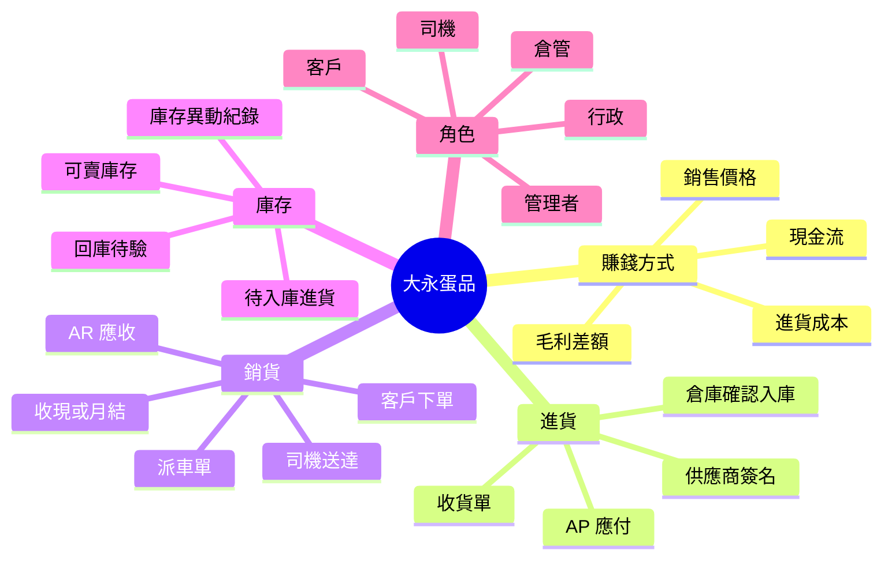
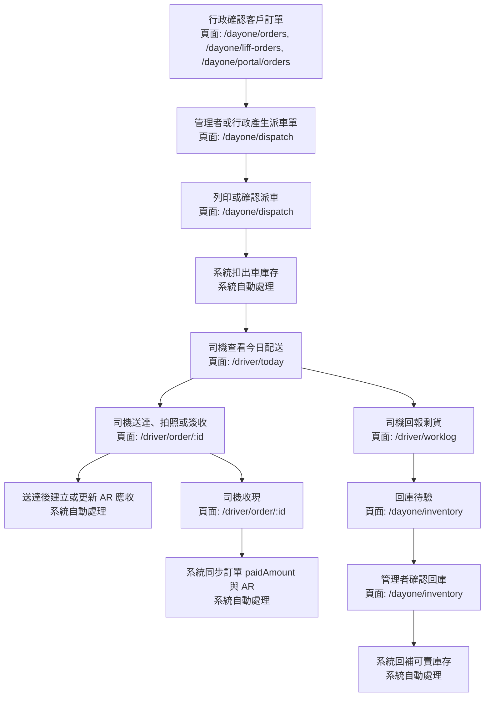

# Dayone 大永真實世界業務流程圖 2026-04-26

這份文件用非工程語言描述大永蛋品的日常營運。目標是讓下一個接手的大腦先理解「這家公司怎麼賺錢、每天誰做什麼、系統哪些地方已經自動處理、哪些地方需要人確認」，再去看程式碼和資料表。

## 一句話理解大永

大永的生意是「買蛋、管庫存、送到客戶、收錢、付供應商」。真正的利潤來自售價和進貨成本的差額；真正的風險來自漏出貨、漏收款、庫存算錯、退貨亂回補、應收應付沒有對上。

## 心智圖

## 一天的真實工作流程

## 進貨流程

| 真實動作 | 做這件事的原因 | 文件或資料 | 對應系統頁面 |
|---|---|---|---|
| 建立進貨收貨單 | 知道今天跟哪個供應商拿了哪些貨 | 進貨收貨單 | `/dayone/purchase-receipts` |
| 司機或人員帶貨回來 | 實際發生進貨物流 | 無固定頁面 | 無 |
| 供應商簽名 | 確認這筆進貨成立，公司開始欠供應商錢 | 供應商簽收紀錄 | `/dayone/purchase-receipts` |
| 建立 AP 應付 | 記錄公司要付供應商多少錢 | `dy_ap_records` | 系統自動處理 |
| 倉庫確認入庫 | 確認貨真的回到大永倉庫，才能當可賣庫存 | 入庫確認 | `/dayone/purchase-receipts` |
| 增加可賣庫存 | 讓庫存表反映真的可賣數量 | `dy_inventory`, `dy_stock_movements` | 系統自動處理 |

重要規則：供應商簽名只代表「這筆進貨成立、AP 成立」，不代表可賣庫存增加。可賣庫存只能在倉庫確認後增加。

## 銷貨與配送流程

| 真實動作 | 做這件事的原因 | 文件或資料 | 對應系統頁面 |
|---|---|---|---|
| 客戶下單 | 確認誰要買、買什麼、哪天送 | 訂單 | `/dayone/orders`, `/dayone/portal/orders`, `/dayone/liff-orders` |
| 產生派車單 | 把訂單安排到司機與路線 | 派車單 | `/dayone/dispatch` |
| 列印或確認派車 | 表示這些貨準備出車 | 派車單、配送清單 | `/dayone/dispatch` |
| 扣出車庫存 | 避免同一批貨被重複賣 | 庫存異動 | 系統自動處理 |
| 司機送達 | 完成履約 | 簽收紀錄 | `/driver/today`, `/driver/order/:id` |
| 建立 AR 應收 | 客戶收到貨後，公司可以向客戶收錢 | `dy_ar_records` | 系統自動處理 |
| 現金收款 | 客戶現場付款 | 收款紀錄 | `/driver/order/:id` |
| 更新 AR 與訂單付款狀態 | 避免訂單說已收、帳務還說未收 | `dy_orders`, `dy_ar_records` | 系統自動處理 |

重要規則：AR 應收應該跟「已送達」或「確定可收款」綁在一起，不應該在未送達時提前亂生。

## 回庫與庫存流程

| 真實動作 | 做這件事的原因 | 文件或資料 | 對應系統頁面 |
|---|---|---|---|
| 司機回報剩貨 | 車上未送完的貨要回報 | 回庫回報 | `/driver/worklog` |
| 進入回庫待驗 | 剩貨不能直接回可賣庫存，要先確認品質和數量 | `dy_pending_returns` | 系統自動處理 |
| 管理者確認回庫 | 確認實際可回補庫存的數量 | 回庫確認 | `/dayone/inventory` |
| 回補可賣庫存 | 回補後才可再銷售 | `dy_inventory`, `dy_stock_movements` | 系統自動處理 |

重要規則：司機回報剩貨不等於庫存立刻增加。管理者確認後才回補。

## 帳務流程

| 帳務項目 | 白話意思 | 何時成立 | 查詢或操作頁面 |
|---|---|---|---|
| AP 應付 | 大永欠供應商的錢 | 供應商簽名後 | 目前主要由系統自動處理，後續可補 AP 管理頁 |
| AR 應收 | 客戶欠大永的錢 | 送達或確認收款後 | `/dayone/ar` |
| 現金收款 | 司機現場收到的錢 | 客戶付款當下 | `/driver/order/:id`, `/driver/worklog` |
| 帳務核對 | 確認訂單、收款、AR 狀態一致 | 每日或每週 | `/dayone/ar`, `/dayone/reports` |

## 角色地圖

| 角色 | 每天主要任務 | 對應頁面 |
|---|---|---|
| 老闆或管理者 | 看總覽、確認回庫、看帳務、處理異常 | `/dayone`, `/dayone/inventory`, `/dayone/ar`, `/dayone/reports` |
| 行政 | 建訂單、管理客戶、產生派車、處理進貨文件 | `/dayone/orders`, `/dayone/customers`, `/dayone/dispatch`, `/dayone/purchase-receipts` |
| 倉管 | 確認入庫、看庫存、確認回庫待驗 | `/dayone/inventory`, `/dayone/purchase-receipts` |
| 司機 | 看今日配送、送達簽收、收現、回報剩貨 | `/driver/today`, `/driver/order/:id`, `/driver/worklog` |
| 客戶 | 下單、查自己的訂單或帳款 | `/dayone/portal/*` |

## 目前已驗證狀態

已驗證或已修補：

- 正式站已恢復登入，Railway production 已改成正確 TiDB `DATABASE_URL`
- TiDB 真資料可讀寫，並做過 rollback write test
- Dayone 租戶確認為 `tenantId=90004 / dayone-eggs`
- `dy_pending_returns` 已建立在真實 TiDB
- 已修補 AP、AR、派車扣庫、回庫待驗幾個主幹斷點
- `npm run build` 和 Railway deployment 已通過

還需要下一階段驗證：

- 全站逐頁真人操作測試
- 多車、多日、多筆訂單的正式情境 replay
- AP 管理頁與更完整帳務頁仍可再補
- UI 亂碼與文案一致性需要清理
