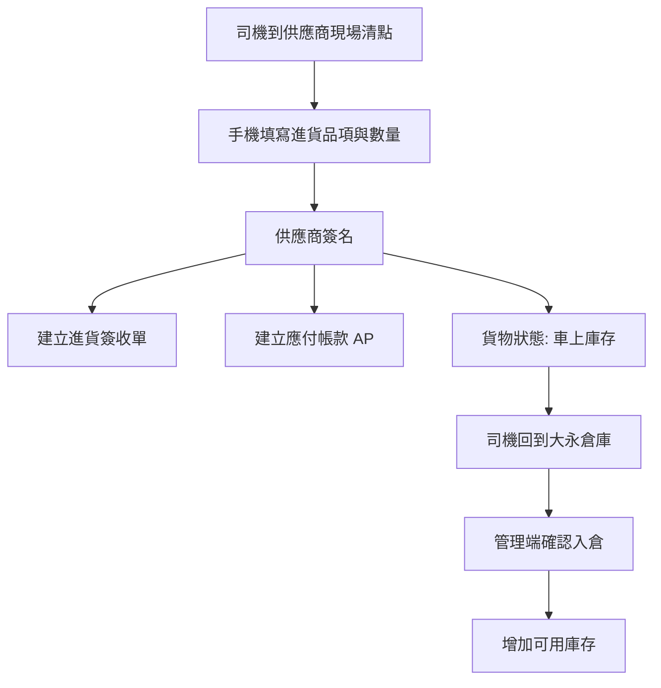
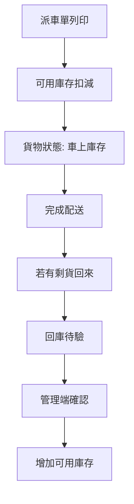

# Dayone 庫存與帳務聯動邏輯圖 2026-04-25

## 核心原則

1. 供應商簽名完成 = 採購入帳成立
2. 採購入帳成立時同步建立應付帳款
3. 採購入帳成立時，不直接增加大永可賣庫存
4. 只有回到大永倉庫並確認入倉後，才增加可賣庫存
5. 司機剩貨回來後，不應直接回到可賣庫存，應走回庫待驗

## 一句話定義

- 可用庫存：已在大永倉庫，可直接拿去賣的貨
- 車上庫存：已屬於大永，但還在司機車上、尚未正式回倉的貨
- 回庫待驗：配送剩貨已回來，但管理端尚未正式確認的貨

## 進貨流程

## 出貨與剩貨流程

## 帳務聯動

### 應付帳款 AP

- 供應商簽名完成時建立
- 代表大永已確認向供應商買到這批貨
- 不需要等倉庫點收入庫才建立 AP

### 應收帳款 AR

- 客戶配送完成後建立或更新
- 依收款狀態同步更新已收、部分收、未收

## 頁面聯動原則

### `/dayone/purchase-receipts`

- `待簽收`
  - 還沒完成供應商簽名
- `待入倉`
  - 已完成供應商簽名
  - 已建立 AP
  - 但尚未增加可用庫存
- `已入倉`
  - 已回到大永倉庫
  - 已增加可用庫存
- `異常`
  - 等待管理端差異對帳後重回待簽收

### `/dayone/inventory`

- 現有庫存頁面中的主數字應代表「可用庫存」
- 未來應補上：
  - 車上庫存
  - 回庫待驗

## 本輪實作決策

1. 供應商簽名後，先建立 AP，不直接加進 `dy_inventory`
2. 新增管理端「確認入倉」動作，確認後才寫入 `dy_inventory`
3. 回庫待驗資料層將在下一階段實作，不在這一輪直接硬改

## 下一階段

1. 補 `/dayone/inventory` 的三段式摘要
2. 導入「回庫待驗」資料層
3. 接上逐頁審查
4. 再進人工測試
