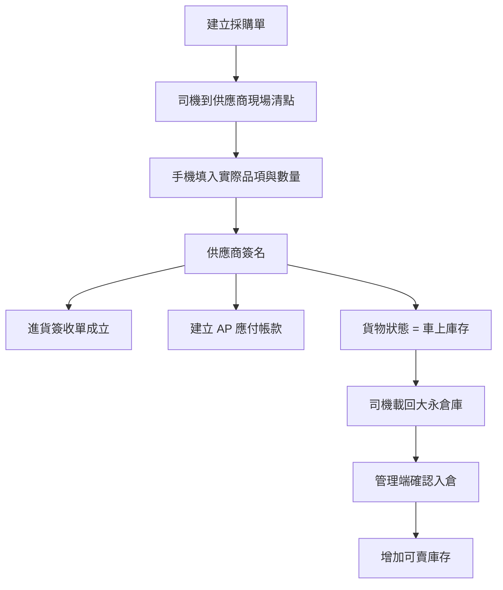
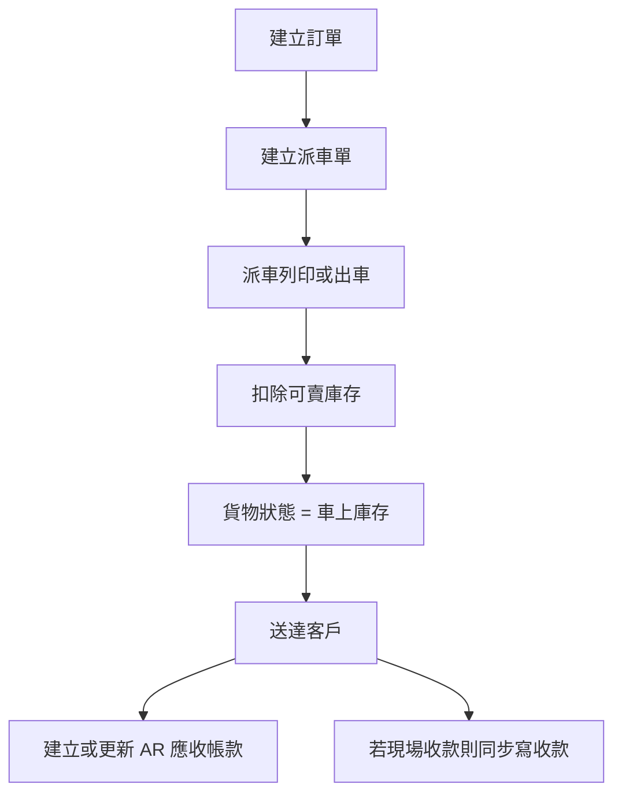
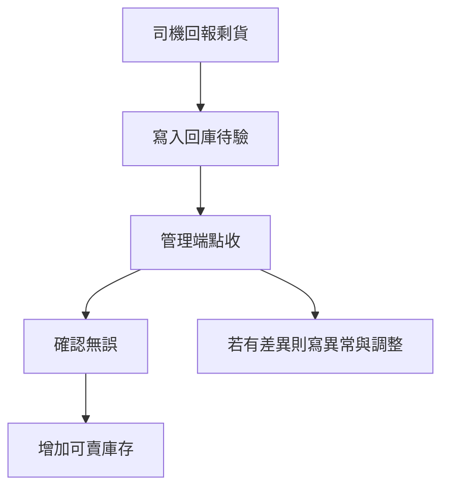

# Dayone 商用邏輯總圖 2026-04-25

這份文件不是為了交差，而是為了讓 Dayone 之後真的能穩定落地、能商用、能接帳、能持續維護。

目前這份文件分成 6 塊：

1. 核心原則
2. 事件主線
3. 帳務聯動
4. 頁面與跳轉矩陣
5. 權限矩陣
6. 已確認缺口與下一步

---

## 1. 核心原則

### 1-1. Dayone 的三種庫存狀態

- 可賣庫存
  - 已經回到大永倉庫
  - 已經完成倉庫確認
  - 可以拿去派車、補單、出貨
- 車上庫存
  - 已向供應商完成簽名
  - 或已從倉庫出車
  - 但還沒回到大永可賣庫存
- 回庫待驗
  - 司機回報有剩貨
  - 但管理端還沒點收
  - 不能直接加回可賣庫存

### 1-2. 採購與入庫要拆成兩個事件

- 採購入帳
  - 司機到供應商現場清點
  - 供應商簽名完成
  - 這一刻代表大永已確認買到這批貨
  - 同步建立應付帳款 AP
- 倉庫入庫
  - 貨回到大永倉庫
  - 管理端或倉庫端確認無誤
  - 這一刻才增加可賣庫存

### 1-3. 帳務與庫存不能混成同一個動作

- 簽名完成不等於可賣庫存增加
- 入倉完成不等於 AP 才建立
- 送達不等於一定已收款
- 司機收現不等於日結已完成

---

## 2. 事件主線

### 2-1. 進貨主線

### 2-2. 出貨主線

### 2-3. 剩貨回庫主線

---

## 3. 帳務聯動

### 3-1. AP 應付帳款

| 事件 | 是否建立 AP | 備註 |
|---|---|---|
| 建立採購單 | 否 | 只是預計採購 |
| 供應商簽名完成 | 是 | 這是目前已確認的正式規則 |
| 倉庫確認入倉 | 否 | 只動可賣庫存，不重複建 AP |
| 進貨異常對帳 | 更新 AP | 應跟修正後簽收內容一致 |
| 付款 | 更新 AP paidAmount/status | 需保留部分付款能力 |

### 3-2. AR 應收帳款

| 事件 | 是否建立 AR | 備註 |
|---|---|---|
| 建立訂單 | 否 | 只是待配送 |
| 送達客戶 | 是 | 應收成立 |
| 現場收現 | 更新 AR | paid / partial / unpaid |
| 管理端補收款 | 更新 AR | 不應覆蓋前次金額 |
| 月結對帳 | 查詢與核對 | 不應重複建立 AR |

### 3-3. 目前已知的邏輯風險

- 風險 1
  - `purchaseReceipt.sign` 已改成只建 AP 不加庫存
  - 但 `purchase.receive` 仍會直接加 `dy_inventory`
  - 這代表 Dayone 還存在兩條不同的入庫規則
- 風險 2
  - `orders.confirmDelivery` 與 `driver.updateOrderStatus(delivered)` 都會碰 AR
  - 雖然現在有 upsert，但「哪個才是正式送達入口」還沒完全收斂
- 風險 3
  - `driver.recordCashPayment` 目前會寫訂單 paidAmount
  - 但不會立刻同步更新 AR
  - 這可能造成訂單金額與 AR 狀態短暫不一致
- 風險 4
  - `dispatch.returnInventory` 仍直接加回 `dy_inventory`
  - 與已確認的「回庫待驗」規則衝突

---

## 4. 頁面與跳轉矩陣

### 4-1. `/dayone/purchase-receipts`

| 狀態 | 使用者看到什麼 | 可做動作 | 下一步 |
|---|---|---|---|
| `pending` | 待簽收 | 供應商簽名、標記異常 | 變成 `signed` 或 `anomaly` |
| `signed` | 待入倉 | 管理端確認入倉 | 變成 `warehoused` |
| `warehoused` | 已入倉 | 查閱、對帳 | 已成為可賣庫存 |
| `anomaly` | 異常待處理 | 差異對帳、修正品項數量 | 回到可簽收或完成修正 |

### 4-2. `/dayone/inventory`

未來應至少同時看到：

- 可賣庫存
- 車上庫存
- 回庫待驗
- 最近異動
- 異常待處理數

目前實際狀態：

- 只有 `dy_inventory.currentQty` 與異動紀錄
- 尚未正式拆出三段式摘要

### 4-3. `/dayone/dispatch`

| 動作 | 目前規則 |
|---|---|
| 建立派車 | 按日期產生派車單 |
| 列印派車 | 扣可賣庫存 |
| 臨時加站補單 | 已接成 `dispatch_supplement` 補單 |
| 已列印後補單 | 會同步扣庫存 |
| 完成後補站 | 已禁止 |
| 剩貨回庫 | 目前仍直接加庫存，未來要改成回庫待驗 |

### 4-4. `/dayone/ar`

應承接：

- 配送後 AR
- 司機現場收現
- 管理端補記收款
- 月結客戶對帳
- 司機現金差異處理

### 4-5. `/dayone` 總覽

總覽頁未來要分成兩層：

- 經營總覽
  - 今日訂單
  - 今日送達
  - 今日應收
  - 今日應付變動
  - 庫存警示
  - 異常數
- 歷史查詢
  - 本月 / 上月
  - 指定月份
  - 指定日期區間
  - 同期比較

目前實際狀態：

- 今日與當月數字可看
- 歷史穿透不夠
- AP / 庫存 / 異常尚未整合成同一張管理總覽

---

## 5. 權限矩陣

### 5-1. 角色定義

| 角色 | 應能做什麼 | 不應看到什麼 |
|---|---|---|
| super_admin | 跨租戶管理、模組開關、全部資料 | 無 |
| manager | 管理 Dayone 全部營運流程 | 不應管理其他租戶 |
| staff | 依職務看局部資料 | 不應看全部成本與完整帳務 |
| driver | 只看自己配送、收款、日結、回庫 | 不應看總帳、全部客戶、全部庫存 |
| portal customer | 只看自己的訂單與帳款 | 不應看內部管理資料 |

### 5-2. 目前實際狀態

- Dayone 後端大多只有 `super_admin / manager` 粗粒度判斷
- Driver 有部分獨立 scope
- Staff 目前幾乎沒有完整的細粒度資料邊界
- Portal customer 有獨立入口，但和內部權限矩陣還沒整合成一份正式規格

### 5-3. Dayone 與宇聯的關係

- 共用平台級身份系統 `users`
- 共用角色欄位 `role`
- 共用未來的 permissions 架構
- 共用 `tenant_modules / module_definitions`
- 業務資料分開：
  - Dayone：`dy_*`
  - 宇聯：`os_*`

結論：

- 不是兩套完全分離帳號系統
- 是同一平台、不同租戶、不同業務資料
- 權限框架應共用，但業務資料可見範圍必須分 tenant

---

## 6. 已確認缺口與下一步

### 6-1. 已確認但尚未完成

1. `purchase.receive` 舊入庫邏輯要重新定義
2. `dispatch.returnInventory` 要改成回庫待驗
3. `/dayone/inventory` 要補三段式摘要
4. AR 建立入口要再收斂，避免多入口造成認知混亂
5. 權限矩陣要從粗粒度角色，升級成角色 x 模組 x 頁面 x API
6. 總覽頁要補期間查詢、歷史對比、AP/AR/庫存異常整合

### 6-2. 目前可當正式規則的部分

1. 供應商簽名 = 採購入帳 + 建立 AP
2. 倉庫確認入倉 = 增加可賣庫存
3. 已列印或配送中的補單要同步扣庫存
4. 已完成派車單不能再補站
5. 進貨異常要走對帳，不可直接偷偷改數量

### 6-3. 不可再犯的邏輯錯誤

1. 不可把「簽名」和「可賣入庫」混成同一個動作
2. 不可讓司機剩貨直接加回庫存
3. 不可只看 build 就說邏輯全對
4. 不可只做前端顯示，沒有後端狀態防呆
5. 不可先做高風險拆包或視覺重構，跳過主流程驗證
