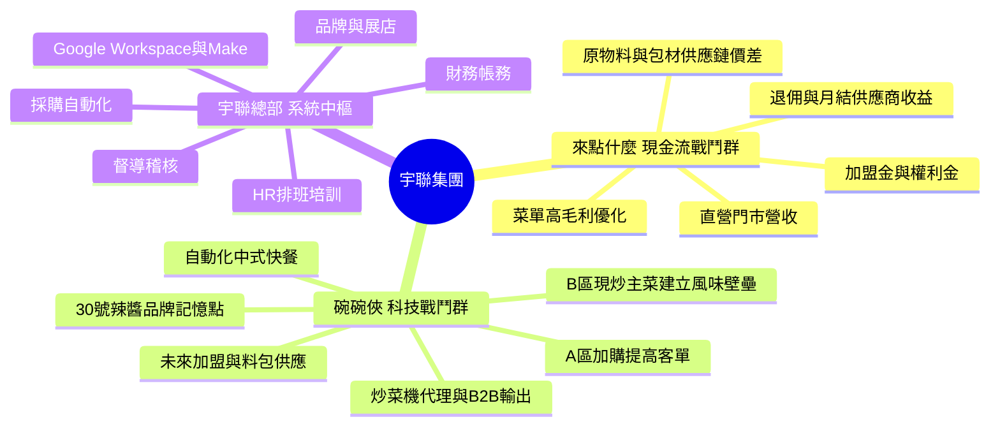
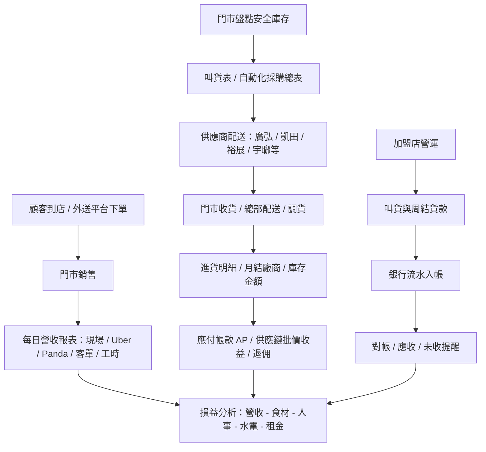
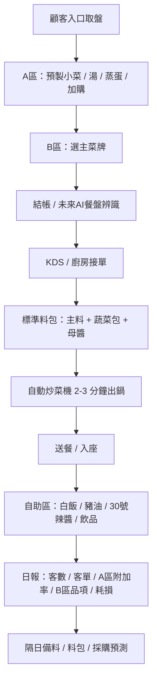

# 宇聯 / 來點什麼 / 碗碗俠真實業務地圖

建立日期：2026-04-26
用途：把零散 Drive、Excel、Google Sheet、企劃文件、現有系統頁面重組成下一階段 ERP / CRM / BOM / 財務閉環的共用理解。

> 原則：本文件把「已由資料證實」和「根據資料推論」分開。後續寫系統時，不可以把推論直接當成商業規則，必須再回到表單、合約、帳務或使用者確認。

---

## 0. 這次實際讀到的資料

### 使用者點名檔案

| 類型 | 檔案 | 這份資料代表什麼 |
|---|---|---|
| 門市清單 | `來點什麼門市清單.docx` | 目前對外營運門市、地址、電話、營業時間 |
| 成本 / BOM | `CA表單1150228(最新).gsheet` | 食材、包材、單位成本、銷價、菜單成本、毛利率 |
| 進貨 | `114、115年進貨明細.zip` | 東勢、逢甲、東山、加盟店、宇聯總部的進貨明細 |
| 庫存 | `宇聯庫存金額統計表115.3月*.xlsx` | 總部 / 倉庫 / 大型物件庫存與金額 |
| 門市進貨舊帳 | `來點什麼-日記帳(逢甲).xlsx` | 逢甲歷史月度進貨統計與早期手工帳 |
| 排班 | `115 班表｜機動人員.xlsx`、`115 班表｜逢甲晚.xlsx` | 人力調度、門市支援、晚班排班 |
| 營收 | `來點什麼-營業額比較表(II).xlsx` | 各店月營收、Uber、Panda、LINE Pay、店內收入 |
| 叫貨 | `庫存叫貨表-逢甲店.xlsx` | 門市安全庫存、最低叫貨量、叫貨表 |
| 提貨調貨 | `來點什麼-提貨調貨明細總表.xlsx` | 門市向總部提貨、門市間調貨、內部結算 |
| 銀行流水 | `宇聯-台新銀行帳戶明細11502.xlsx` | 銀行進出、加盟店貨款、供應商付款、費用 |
| 月結供應商 | `月結廠商進貨金額(藍色字).xlsx` | 廠商成本、批價、收益，用於 AP / 供應鏈利潤 |
| 菜單圖 | `2026菜單-01_0.jpg`、`2026菜單-02_0.jpg` | 對外販售品項與最新菜單價格 |

### Drive / 同步盤補讀的關鍵資料

| 類型 | 資料 | 這份資料補到什麼 |
|---|---|---|
| 門市總表 | `2026_宇聯_門市總表` | 12 間營運中門市，與 docx 門市清單互相驗證 |
| 智慧報表 | `來點什麼-智慧報表系統` | 每日店別營收、現場 / Uber / Panda、來客數、客單價、工時產能 |
| 自動採購 | `!!!2026_自動化採購總表` | Make / Google Sheet 已把門市叫貨彙整成供應商、商品、數量、地址、電話 |
| 年度戰略 | `幹部戰略手冊3.0 260102` | 2026 宇聯四大戰略、角色分工、來點什麼與碗碗俠定位 |
| 碗碗俠企劃 | `碗碗俠企劃V4.pdf` | 商業模式、A/B 區、自助區、財務模型、展店與加盟策略 |
| 碗碗俠 SOP | `碗碗俠_試菜SOP記錄表_完整版_v2_20260424.xlsx` | 2026-04-26 使用者確認為最新試菜後資料；22 道菜試菜、B 區主菜、A 區小菜、機器參數、食材配方 |
| 碗碗俠籌備 | `碗碗俠_公司設立流程與開幕前準備_20260423.xlsx` | 2026-04-26 使用者確認為最新籌備資料；公司設立、30 號辣醬、料包合規、設備、開幕前流程 |

---

## 1. 一句話總結

宇聯不是單純餐飲公司，而是「餐飲品牌孵化 + 加盟總部 + 供應鏈利潤 + 自動化營運系統」。

來點什麼是目前的現金流與加盟母體，靠門市營收、加盟展店、供應鏈批價、原物料與包材流通賺錢。
碗碗俠是下一個科技餐飲模型，靠自動炒菜機、料包、標準 SOP、人效提升和未來加盟 / 設備代理放大。

---

## 2. 三個獲利引擎

### 已證實

- 來點什麼目前有 12 間營運中門市資料，包含直營與加盟。
- 來點什麼已有每日營收智慧報表，欄位包含店別、總銷售額、現場、Uber、Panda、來客數、客單價、電話 / 外送、人員工時、人效。
- 自動化採購總表已有「叫貨時間、收件人、供應商、商品名稱、數量、單位、運送模式、地址、電話、統整日」。
- CA 表已包含大量原物料、包材、菜單品項、成本、銷價、毛利率與平台價。
- 碗碗俠已不只是想法，已經有 V4 企劃、公司設立流程、開幕準備、試菜 SOP 表。

### 合理推論

- 來點什麼已經從「每店自己做帳」走向「總部統一看營收、採購、庫存、供應商、調貨、銀行」。
- 宇聯系統下一階段不是只做 ERP 頁面，而是要把 Google Sheet / Make / Excel 的「事實來源」逐步搬進資料庫，成為可追溯、可稽核、可自動化的總部系統。
- 碗碗俠未來 ERP 不應直接套來點什麼，而要多出「試菜 SOP、炒鍋參數、料包批號、A 區耗損、B 區 KDS、設備維修」等資料模型。

---

## 3. 來點什麼真實營運閉環

### 對應系統頁面

| 真實動作 | 現有 / 應有系統頁面 | 狀態 |
|---|---|---|
| 門市每日營收上報 | `/dashboard/daily-report` | 現有系統有頁面；Google Sheet 智慧報表是重要事實來源 |
| 看各店損益 | `/dashboard/profit-loss` | 現有頁面；需確認讀取來源與智慧報表 / AP / 人事一致 |
| 門市叫貨 | `/dashboard/purchasing` | 現有頁面；Make 自動化採購總表可對應匯入 |
| 庫存安全量 / 盤點 | `/dashboard/inventory` | 現有頁面；需與逢甲叫貨表、總部庫存表對齊 |
| 供應商月結 | `/dashboard/accounting` | 現有頁面；需核對月結廠商進貨金額與 os_payables |
| 銀行流水對帳 | `/dashboard/accounting` | 現有頁面；銀行流水 Excel 已有欄位，可做匯入與自動匹配 |
| 門市提貨 / 調貨 | `/dashboard/accounting`、`/dashboard/franchisee-payments` | 現有部分邏輯；需正式做 transfer / internal receivable |
| 加盟主貨款 / 週結 | `/dashboard/franchisee-payments` | 現有頁面；需與銀行入帳及調貨資料閉環 |
| 菜單成本 / BOM | `/dashboard/ca-menu`、`/dashboard/products` | 現有部分功能；CA 表需正規化為版本化 BOM |
| 排班 / 支援 | `/dashboard/scheduling` | 現有頁面；班表仍主要在 Excel / Google Sheet |
| 督導稽核 / SOP | `/dashboard/sop`、`/dashboard/checklist` | 現有頁面；需要加入加盟督導稽核表與防跑料邏輯 |
| 加盟詢問 / CRM | `/dashboard/franchise-inquiries`、`/dashboard/franchisees` | 現有頁面；後續需接 28 天訓練、合約、開店進度 |

---

## 4. 來點什麼資料如何互相驗證

### 4.1 門市資料

`來點什麼門市清單.docx` 與 `2026_宇聯_門市總表` 互相驗證，目前營運中門市至少包含：

- 逢甲旗艦店
- 東勢店
- 東山店
- 大里店
- 草屯中山店
- 北區永興店
- 財神店
- 民權店
- 西屯福上店
- 瀋陽梅川店
- 北屯昌平店
- 南屯林新店

使用者於 2026-04-26 確認：南屯林新店正確地址是「台中市南屯區惠中路三段54號」。若舊表出現「大墩十一街453號」，視為舊資料，不得覆蓋正確地址。

### 4.2 成本 / BOM / 菜單

CA 表的角色不是單純菜單，而是「來點什麼食材與商品成本總表」：

- 原物料分類：冷凍、韓國食材、乾貨、茶包 / 泡粉、醬粉、包材、公司配送、訂製品等。
- 供應商：廣弘、凱田、裕展、韓濟、宇聯、椪椪、長春騰、米谷、藍格等。
- 欄位邏輯：單位成本、銷價單位、成本、銷價、出貨單位。
- 菜單邏輯：品名、主食、內容物、包材費、內用 / 外帶成本、售價、利潤、毛利率、平台售價。
- 菜單圖可作為「對外售價」驗證來源，但真正算毛利要以 CA 表為準。

系統結論：
`/dashboard/products` 應該存「原物料 / 供應商 / 單位成本 / 批價」。
`/dashboard/ca-menu` 應該存「菜單品項 / 配方 / 用量 / 包材 / 版本 / 售價 / 平台價 / 毛利率」。

### 4.3 採購 / 進貨 / 供應鏈利潤

目前採購資料有三層：

1. `!!!2026_自動化採購總表`：每日 Make 統整後的叫貨行為，最接近即時訂單。
2. `114、115年進貨明細.zip`：店別 / 月份 / 供應商 / 品項 / 成本 / 批價 / 數量，適合回補歷史資料。
3. `月結廠商進貨金額(藍色字).xlsx`：供應商月結成本、批價、收益，適合 AP 與供應鏈利潤核對。

系統結論：

- 叫貨單是「採購需求」。
- 供應商配送 / 收貨是「進貨事實」。
- 月結廠商表是「付款與供應鏈收益事實」。
- 銀行流水是「付款是否真的發生」。

### 4.4 庫存 / 調貨

庫存資料有兩種不同層級：

- 門市安全庫存：例如 `庫存叫貨表-逢甲店.xlsx`，用來決定門市要不要補貨。
- 總部資產庫存：例如 `宇聯庫存金額統計表115.3月.xlsx`，包含包材、紙碗、飯捲盒、貼紙、大型設備。

調貨資料代表第三種流動：

- 不是外部供應商進貨。
- 是門市與門市、或總部與門市間的內部貨物流動。
- 最後可能形成門市應付 / 應收或加盟主貨款。

系統結論：
庫存不能只有一張 `os_inventory`，至少要區分：

- 總部倉庫庫存
- 門市安全庫存
- 門市實際庫存
- 加盟店提貨 / 調貨
- 包材 / 設備 / 食材不同類型

### 4.5 營收 / 人效

`來點什麼-智慧報表系統` 已經非常接近 ERP 日報事實表，欄位包含：

- 日期、店別、總銷售額
- 現場業績、Uber、Panda
- 總來客數、客單價
- 電話訂單、外送訂單、作廢
- 上班人數、人員工時、人員工時產能
- 評論數與星期判定

系統結論：
`/dashboard/daily-report` 應以這張表的欄位為核心，並與排班資料對齊，算出「人效」與「每店日損益」。

---

## 5. 碗碗俠真實業務模型

### 碗碗俠與來點什麼最大的不同

| 面向 | 來點什麼 | 碗碗俠 |
|---|---|---|
| 核心商品 | 早餐 / 早午餐 / 飯捲 / 蛋餅 / 炒麵 / 飲品 | 自動化中式現炒快餐 |
| 成本核心 | 食材 + 包材 + 平台抽成 + 門市人事 | 食材 + 料包 + 設備折舊 + 人效 |
| SOP 重點 | 菜單配方、門市出餐、加盟訓練、叫貨 | 炒鍋參數、料包標準、A/B 區動線、KDS |
| 擴張方式 | 加盟總部 + 供應鏈 | 先直營驗證，再整店輸出 / 料包供應 / 設備代理 |
| 資料模型 | 門市、加盟主、叫貨、進貨、庫存、日報 | 菜品、試菜、炒鍋參數、料包批號、A區耗損、設備 |

### 已證實的碗碗俠資料

- 截至 2026-04-26，碗碗俠最新事實來源應優先看兩個檔案：`碗碗俠_試菜SOP記錄表_完整版_v2_20260424.xlsx` 與 `碗碗俠_公司設立流程與開幕前準備_20260423.xlsx`。舊企劃 PDF 可作戰略參考，但若與這兩份衝突，先以這兩份為準。
- V4 企劃定義：高 CP 值、半自動 / 全自動炒鍋、中式快餐、自助白飯 / 豬油 / 30 號辣醬。
- 財務模型：單店啟動資金約 260 萬，標準店日客 160 人、客單 210、月營收約 100.8 萬、食材包材成本抓 40%、月淨利約 22.88 萬。
- SOP 試菜表包含 22 道菜，分 A 區與 B 區。
- B 區菜品如麻婆豆腐、回鍋肉、辣子雞、黃燜雞等，需要記錄食材、用量、備料狀態、保存方式、機型。
- 公司設立 / 開幕準備已包含料包合規、30 號辣醬、設備參數、菜單確認、設備盤點。

### 碗碗俠未來系統頁面建議

目前 repo 尚未看到碗碗俠專屬 ERP 頁面。建議不要硬塞進來點什麼頁面，而是新增品牌 / tenant 模組：

| 模組 | 頁面建議 | 資料 |
|---|---|---|
| 菜品研發 | `/dashboard/bowlhero/recipes` | A/B 區菜品、版本、售價、Food Cost |
| 試菜 SOP | `/dashboard/bowlhero/trials` | 試菜日期、次數、問題、是否通過 |
| 炒鍋參數 | `/dashboard/bowlhero/wok-params` | 機型、溫度、秒數、轉速、投料順序 |
| 料包管理 | `/dashboard/bowlhero/meal-kits` | 主料包、蔬菜包、母醬包、批號、保存期限 |
| A 區耗損 | `/dashboard/bowlhero/a-zone-waste` | 預製量、銷售量、報廢量、耗損率 |
| KDS / 出餐 | `/dashboard/bowlhero/kds` | 訂單、菜牌、炒鍋佇列、出餐時間 |
| 設備維修 | `/dashboard/repairs` 可擴充 | 炒菜機、排煙、冷藏、蒸菜台、AI 結帳 |
| 單店損益 | `/dashboard/profit-loss` 可擴充 | 客數、客單、食材、料包、人事、租金、設備攤提 |

---

## 6. 目前系統與真實資料的落差

| 區塊 | 現有狀態 | 風險 | 下一步 |
|---|---|---|---|
| CA / BOM | 有 `/dashboard/ca-menu`，CA 表在 Google Sheet | 若未版本化，菜單成本會被新舊價格污染 | 建立 `menu_recipe_versions` / `recipe_ingredients` |
| 採購 | 有 `/dashboard/purchasing` 與 Make 匯入概念 | Google Sheet 是事實來源，DB 是否完整接住需查 | 對比 `!!!2026_自動化採購總表` 與 `os_procurement_orders` |
| 進貨 / AP | 有 `os_payables` 邏輯 | 月結廠商表、銀行付款、DB AP 可能不一致 | 做 115 年 2-3 月抽樣核對 |
| 退佣 / 供應鏈收益 | 有 `/dashboard/rebate` | 規則複雜，藍色字月結表含成本 / 批價 / 收益 | 用月結表反推規則，補測試 |
| 庫存 | 有 `/dashboard/inventory` | 門市庫存、總部庫存、設備庫存混在商業上不同 | 拆成倉庫 / 門市 / 設備 / 包材類型 |
| 調貨 | 有部分 transfer / franchisee payment 邏輯 | 調貨會形成內部應收應付，不能只當庫存移動 | 正式建立調貨單 -> 結算單 |
| 銀行對帳 | 有 `/dashboard/accounting` | 台新流水目前還是 Excel，需避免手工錯帳 | 匯入銀行流水、自動匹配 AP / AR / 費用 |
| 排班 / 人效 | 有 `/dashboard/scheduling` | 班表 Excel 有大量真實邏輯，DB 未必有員工主檔 | 先建員工 / 班別 / 門市支援模型 |
| 督導稽核 | 有 SOP / checklist | 戰略手冊提到防跑料、巡店、督導津貼，系統未閉環 | 建立巡店稽核與 POS / 進貨差異檢查 |
| 碗碗俠 | 有企劃與 SOP，無明確系統模組 | 若照來點什麼硬套，會漏掉炒鍋 / 料包 / A區耗損 | 新增碗碗俠模組設計 |

---

## 7. 下一階段建置順序

### 第一批：把來點什麼現金流閉環先打通

1. 實庫盤點 `tenantId=1`：確認 `os_` 表、筆數、Google Sheet 匯入狀態。
2. 自動化採購核對：`!!!2026_自動化採購總表` -> `os_procurement_orders` / `os_procurement_items`。
3. AP 核對：`月結廠商進貨金額(藍色字)` -> `os_payables`。
4. 銀行流水核對：`宇聯-台新銀行帳戶明細11502` -> `os_bank_transactions` -> AP / franchisee payments。
5. 日報核對：`來點什麼-智慧報表系統` -> `os_daily_reports` -> `/dashboard/profit-loss`。

### 第二批：BOM / 菜單成本正式化

1. 匯入 CA 表原物料與供應商。
2. 建立菜單配方版本，不直接覆蓋舊成本。
3. 用 2026 菜單圖核對前台售價。
4. 把平台價、內用 / 外帶成本、包材費、毛利率納入。

### 第三批：加盟 / 調貨 / 督導閉環

1. 加盟主 CRM：詢問 -> 評估 -> 合約 -> 28 天訓練 -> 開店。
2. 調貨單：門市 A 給門市 B -> 庫存移轉 -> 金額 -> 內部應收應付。
3. 督導稽核：巡店表 -> 問題 -> 改善期限 -> 罰款 / 獎勵 / 存證。
4. 防跑料：POS 銷售量 + BOM 理論耗用 + 實際進貨 / 庫存差異。

### 第四批：碗碗俠從 0 到 1 系統

1. 碗碗俠獨立 brand / tenant / module。
2. 試菜 SOP 表匯入，建立菜品、配方、炒鍋參數。
3. 建立料包、A 區耗損、設備維修、KDS 模型。
4. 用企劃財務模型建立單店損益 dashboard。

---

## 8. 給下一個大腦的工作提示詞

你現在要做的不是「寫漂亮後台」，而是把宇聯集團的真實營運資料變成能賺錢、能對帳、能擴張的系統。

請先讀：

- `CLAUDE.md`
- `docs/yulian-ordersome-wanwansia-business-map-2026-04-26.md`
- `docs/business-logic-reverse-prompt-2026-04-26.md`
- `docs/ordersome_module_map_v1.html`
- `docs/ordersome_data_flow_v1.html`
- `docs/finance-system-architecture.md`

工作方式：

1. 不要從 UI 開始，先從「錢怎麼進來、貨怎麼流、帳怎麼結」開始。
2. 所有 Google Sheet / Excel 都要判斷是不是事實來源、輔助表、歷史表或素材。
3. 任何商業規則都標記為「已證實 / 推論 / 待確認」。
4. 系統頁面必須對應真實動作，不可做只有展示但不能對帳的功能。
5. 優先打通來點什麼現金流閉環，再做碗碗俠新模組。
